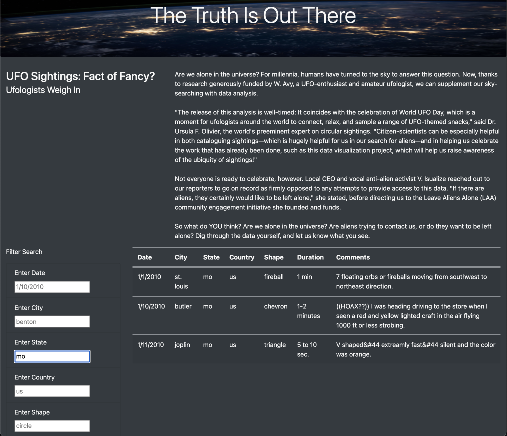
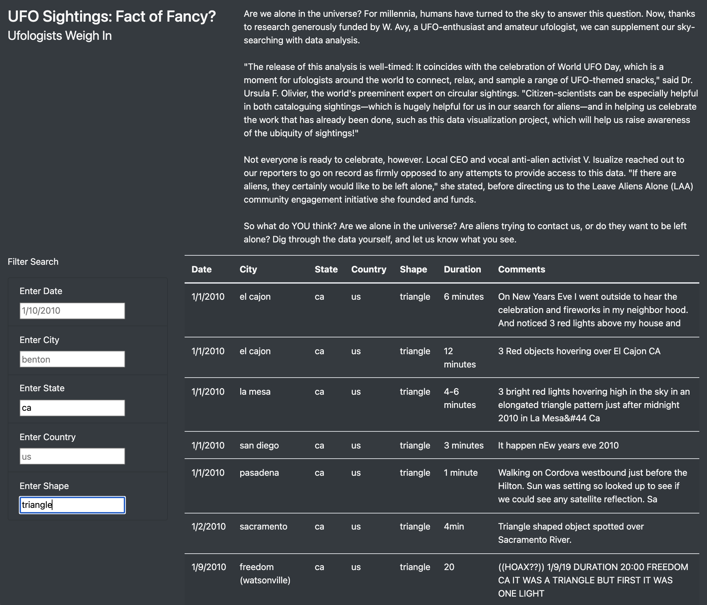
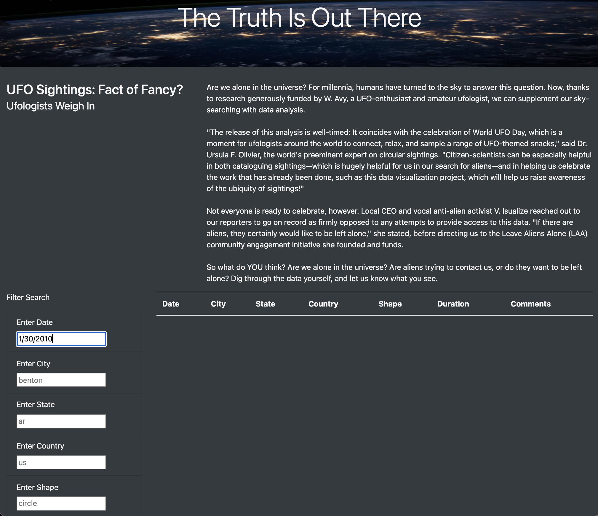

# UFOs

## Overview of UFOs Analysis

The webpage we made for Dana displays a table and is working properly, however, she wants us to provide a more in-depth analysis of UFO sightings by allowing users to filter for multiple criteria simultaneously. We will add filters for the date, city, state, country, and shape.

### Purpose

The purpose of this analysis is to add filters for the date, city, state, country, and shape to Dana's existing UFOs website, to allow users to filter the data in many ways.

## UFOs Analysis Results

### Website Functionality

Our website displays a table with data about UFO sightings in January, 2010. We made a function that allows users to filter the table data in different ways, such as by date, city, state, country, and/or shape. All one needs to do is type a filter into the correct box, with the right syntax, and either click enter or move the mouse. This will update the table. The image below shows the table with the filter "mo" for state.

The next image shows the table with two filters, "ca" for state and "triangle" for shape.

## UFOs Analysis Summary

One major drawback of this new design is that it is possible to enter a filter that doesn't exist in the table. You need to know the data in the table to understand what filters you want. In the image below, the date "1/30/2010" was entered as a filter. However, there is no data for that date.

It would be helpful to have a dropdown menu with all the possible filter options. Also, if there were more months included in our data, it would be beneficial to have a date range selector using a jquery plugin.

